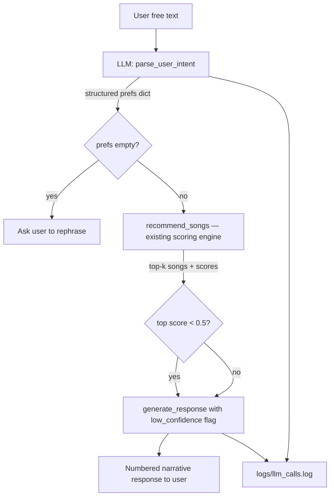

# VibeFinder AI

**Original project:** VibeFinder 1.0 (CodePath AI110 Module 3) — a pure content-based music recommender that scored songs against hardcoded user profiles using tier-weighted similarity. It returned ranked results with plain-English explanations but had no natural language input, no LLM, and a fixed 18-song catalog.

**Final project:** VibeFinder AI wraps that scoring engine in a RAG pipeline. Users describe what they want in plain English, a Claude LLM parses the intent into structured preferences, the original recommender retrieves the best matches from a 210-song catalog, and a second LLM call generates a conversational response. The core scoring logic is unchanged — new AI layers were added around it.

---

## How the System Works

### RAG Pipeline



**Step 1 — Parse:** Claude receives the user's free text and outputs a JSON object with structured music preferences (`genre`, `mood`, `energy`, `acousticness`, etc.) and an optional `k` (number of songs requested). The output is validated and sanitized before use.

**Step 2 — Retrieve:** The existing tier-weighted scoring engine scores all 210 songs against the parsed preferences and returns the top-k ranked results. No LLM is involved here — this is the original Module 3 algorithm.

**Step 3 — Generate:** Claude receives the user's original request plus the ranked songs and writes a numbered, conversational response explaining why each song fits.

### Scoring Engine (unchanged from base project)

Each song is scored by computing weighted similarity across only the features the user specified:

```
score = sum(weight[f] * similarity(user[f], song[f])) / sum(weight[f])
```

| Tier | Features | Weights |
|---|---|---|
| 1 (vibe) | genre (3.0), mood (3.0), energy (2.5) | Highest |
| 2 (support) | acousticness (1.5), valence (1.5) | Medium |
| 3 (tiebreaker) | danceability (0.75), tempo_bpm (0.5) | Lowest |

### Multi-Tag Genre System

Every song carries 3 pipe-separated genre tags (e.g., `bachata|latin pop|spanish`) instead of a single genre string. This enables natural queries like "spanish songs", "japanese music", or "reggaeton and bachata" to surface songs that were previously unreachable.

**3-layer structure:**
1. **Specific genre** — most precise label (`bachata`, `reggaeton`)
2. **Genre family** — broader bucket (`latin pop`)
3. **Cultural/language tag** — for non-English songs (`spanish`, `japanese`, `mandarin`, `korean`, etc.); related style for English songs

**Scoring with multi-genre queries:** When a user asks for "reggaeton and bachata", the LLM returns `"genre": ["reggaeton", "bachata"]`. A song scores 1.0 on genre if *any* of its tags matches *any* of the requested genres. This means a pure bachata song correctly surfaces in a reggaeton+bachata search without requiring it to literally be both.

### Guardrails & Logging

| Guardrail | Behavior |
|---|---|
| Top score < 0.5 | LLM is told to gently note the catalog has limited options |
| Empty prefs after parsing | System asks user to rephrase — no Bedrock call wasted |
| Invalid genre/mood from LLM | Dropped silently; scoring continues on remaining features |
| Numeric values out of range | Clamped to valid range (energy 0–1, tempo 60–200) |
| Bedrock API error | Caught, printed as clean message, no crash |

All LLM calls logged to `logs/llm_calls.log` with timestamp, input, and raw response.

---

## Sample Interactions

**1 — Genre + mood request:**
```
You: I want something chill to code to late at night.

VibeFinder: Of course! Here are some perfect late-night coding tracks:

1. "Focus Flow" by LoRoom — A lofi hip-hop and ambient blend with a focused mood and perfectly matched tempo, making it ideal for staying locked in during a late-night session.
2. "Midnight Coding" by LoRoom — The title says it all; this chill lofi indie track has high acousticness and a near-perfect tempo match, creating a relaxed atmosphere great for late-night work.
...
```

**2 — Multi-genre request with count:**
```
You: Give me a list of 12 reggaeton and/or bachata songs.

VibeFinder: Sure! Here are 12 great reggaeton and bachata tracks:

1. "LA CAPI" by Myke Towers — A confident Latin trap-infused reggaeton banger with a swagger-driven energy that's perfect for hyping yourself up.
2. "Si No Le Contesto" by Plan B — A smooth, romantic reggaeton track with a laid-back groove that captures the push-and-pull tension of a love dynamic.
...
```

**3 — Cultural/language query:**
```
You: I want 10 Chinese songs.

VibeFinder: Sure! Here are 10 Chinese songs you might enjoy:

1. **"一路生花" by 温奕心** — A soaring Mandopop track with an inspiring mood, perfect for lifting your spirits and keeping you motivated.
2. **"半點心" by Grasshopper** — A classic Cantopop gem with a nostalgic feel, transporting you back to the golden era of Hong Kong pop music.
...
```

---

## Getting Started

### 1. AWS Account and Bedrock Setup

1. Create or log in to an [AWS account](https://aws.amazon.com).

2. In the AWS Console, navigate to **Amazon Bedrock** (region: **us-east-1**):
   - Go to **Model access** → request access to **Claude Sonnet** by Anthropic. Wait for status to show "Access granted."
   - Go to **Model Catalog** → click **Claude Sonnet 4.6** → copy the **Model ID** and prepend `us.` to it (e.g., `us.anthropic.claude-sonnet-4-6`).

3. In **IAM** → **IAM Users** → **Create user**:
   - Enter any **User name**.
   - Under **Set permissions**, click **Attach policies directly** and select **AmazonBedrockFullAccess**.
   - Click **Create User**.

4. Under the new user's **Security credentials** tab → **Create access key** (use case: Local code) → copy the **Access Key ID** and **Secret Access Key**.

5. Install the [AWS CLI](https://docs.aws.amazon.com/cli/latest/userguide/install-cliv2.html), then configure it:

   ```bash
   aws configure
   # Prompts: Access Key ID, Secret Access Key, region (us-east-1), output format (json)
   ```

6. Verify access:

   ```bash
   aws sts get-caller-identity
   ```

### 2. Python Environment

1. Create and activate a virtual environment:

   ```bash
   python -m venv venv
   venv\Scripts\activate        # Windows
   source venv/bin/activate     # Mac/Linux
   ```

2. Install dependencies:

   ```bash
   pip install -r requirements.txt
   ```

   > **Note (Windows):** `botocore[crt]` is required for the AWS credential provider chain and is already listed in `requirements.txt`.

### Running the App

```bash
python -m src.chat      # AI chat loop (primary interface)
python -m src.main      # Original batch runner with hardcoded profiles
```

### Running Tests

```bash
pytest                                # All 74 unit tests (no Bedrock calls)
pytest -m integration                 # End-to-end live Bedrock test
pytest tests/test_llm.py -v           # LLM layer tests only
pytest tests/test_recommender.py -v   # Scoring engine tests only
```

---

## Architecture Overview

```
src/
  recommender.py   — Scoring engine, data classes (unchanged from base)
  main.py          — Batch CLI runner with hardcoded profiles (unchanged)
  llm.py           — Bedrock LLM calls: parse_user_intent(), generate_response()
  chat.py          — Interactive loop, entrypoint for the AI demo

tests/
  test_recommender.py  — 45 scoring engine tests (all pass)
  test_llm.py          — 26 LLM layer tests (all mocked, no Bedrock calls)

data/
  songs.csv        — 210 songs, 3 genre tags each, 7 audio features

logs/
  llm_calls.log    — Runtime log of every Bedrock call (git-ignored)
```

**Component responsibilities:**
- `recommender.py` is the retrieval layer — pure Python, no AI
- `llm.py` is the AI layer — wraps Bedrock, validates outputs, logs calls
- `chat.py` is the orchestrator — connects user input to both layers and enforces guardrails

---

## Design Decisions

**Why RAG over a pure LLM approach?**
Asking Claude to recommend songs directly would require embedding the full catalog in every prompt (expensive and brittle). Instead, the catalog is queried algorithmically and only the relevant results are passed to the LLM for narration. The LLM never has to "know" all 210 songs — it just explains the ones the retriever found.

**Why AWS Bedrock instead of the Anthropic API?**
The project uses AWS credits rather than separate Anthropic API credits. Bedrock provides the same Claude models via `boto3` — the only code difference is the client and request format.

**Why pipe-separated genre tags instead of a separate tags column?**
Keeping a single `genre` column that supports both `"pop"` and `"pop|indie pop|electronic"` preserves backward compatibility with `load_songs()` and the scoring engine. The split happens at load time, and `score_song()` uses a defensive `isinstance` check so both formats always work.

**Why "any match = 1.0" for multi-genre scoring?**
When a user asks for "reggaeton and/or bachata", they want songs from *either* genre — not songs that are literally both. Partial credit would penalize a great pure-bachata song just because it isn't also reggaeton. Full credit for any matching tag produces the most intuitive mixed results.

**Why keep the base scoring engine unchanged?**
The tier-weighted scoring already handles the recommendation quality problem well. Adding LLM layers on top (rather than replacing the scorer) lets the system benefit from both: fast, explainable algorithmic ranking plus natural language I/O.

---

## Testing Summary         

| Test suite | Count | Coverage |
|---|---|---|
| `test_recommender.py` | 45 | Scoring math, tier weights, tempo normalization, edge cases, explanation generation, CSV loading |
| `test_llm.py` | 26+3 | `_validate_prefs` edge cases, JSON parsing, markdown fence stripping, invalid genre/mood filtering, multi-genre list validation, guardrail threshold, response format |
| Integration (`-m integration`) | 1 | Full live Bedrock round-trip: free text → prefs → songs → narrative |

**What worked:** The LLM reliably extracts genre and mood from natural language. Multi-genre queries (`["reggaeton", "bachata"]`) surface songs from both pools. Cultural tags (`spanish`, `japanese`, `mandarin`) make non-English catalogs fully discoverable.

**What the AI struggled with:** Vague single-word requests like "spanish songs" were initially returning empty prefs because "spanish" wasn't a recognized genre. Adding it as a cultural tag (mapped to actual songs via the tagging system) resolved this. The LLM also occasionally wraps JSON in markdown fences despite the system prompt saying not to — the response cleaner strips them defensively.

**What surprised me:** The scoring engine produces very different top-5 lists for "reggaeton" vs "reggaeton and bachata" — adding bachata to the query doesn't just add bachata songs, it changes the relative ranking because bachata songs now compete on equal genre footing. This was only visible after running the full pipeline, not during unit testing.

---

## Issues Fixed

1. **Single genre tag per song.** Songs were tagged with one genre string, which made many queries return no results. "La Bachata" by Manuel Turizo was tagged only as `latin pop`, so a search for "bachata" returned nothing. Replaced with a 3-tag pipe-separated system (`specific genre | genre family | cultural tag`) so songs surface from multiple query angles.

2. **Missing cultural/language tags.** Searching "Spanish songs" or "Chinese music" returned empty results because the LLM correctly identified the intent but the validator dropped the value as an unknown genre. Added `spanish`, `french`, `japanese`, `mandarin`, `cantonese`, and `korean` as recognized genre values in both the song catalog and the validation layer.

3. **Response truncation for large song lists.** With `max_tokens=300`, responses for 10–15 song requests were cut off mid-sentence. Fixed by scaling `max_tokens` dynamically: `max(400, len(results) * 80 + 100)`.

---

## Limitations

1. **No balanced multi-genre splits.** When a user asks for "5 Spanish and 5 Chinese songs," the system treats it as a single multi-genre query and returns the top 10 overall matches. Since all matching songs tie on genre score (1.0), secondary features break the tie — which can produce an uneven split (e.g., 6 Spanish / 4 Chinese). Enforcing a proportional split would require running separate retrieval queries per genre.

2. **No conversation memory.** Each request is fully independent. The system cannot build on prior turns ("give me more like #3" or "make them slower") because there is no session state between queries.

3. **Fixed local catalog.** Recommendations are limited to the 210 songs in `songs.csv`. The system cannot discover new music, follow trends, or expand its catalog without a manual CSV edit.

4. **Binary genre and mood matching.** Genre and mood similarity are all-or-nothing (1.0 or 0.0). "Indie pop" and "pop" score zero similarity to each other — there is no concept of genre proximity or partial credit for related styles.

5. **LLM narration is confidently positive.** Even when the top match score is below 0.5, the generated response sounds enthusiastic. The low-confidence guardrail adds a soft disclaimer but does not suppress the positive framing.

---

## Video Walkthrough

Loom Link: https://www.loom.com/share/7010f453ab2c4b479ec040bdbc60a63a

---

## Reflection and Ethics

**What this project taught me about AI and problem-solving:**
The biggest lesson was that integrating an LLM doesn't just add capability — it shifts where problems show up. The original recommender had silent failures (low scores, unintuitive rankings). The AI version has vocal failures: confident-sounding responses for poor matches, LLM output that needs parsing and sanitization, and edge cases the model "understands" conceptually but handles inconsistently (like proportional genre splits). Engineering around an LLM means designing guardrails, not just features. The retrieval layer also taught me that catalog design matters as much as the algorithm — tagging 210 songs with the right genre structure had more impact on recommendation quality than any code change.

**Could this be misused?**
The system recommends from a fixed local catalog — it cannot access external music or user data, so the misuse surface is low. The main risk is the LLM generating hallucinated song details (wrong artist, wrong genre description) if the context passed to it is ambiguous. Mitigation: all song metadata in the generation prompt comes directly from the catalog, not from the LLM's training data.

**What surprised me during testing:**
The multi-genre scoring change had an unexpected side effect: songs with broad tag overlap (e.g., `pop|indie pop|electronic`) suddenly appeared in searches they never did before, which sometimes felt like noise. The three-tag structure keeps this in check — songs don't accumulate enough tags to match unrelated queries.

**Collaboration with AI:**
Claude was most helpful structuring the Bedrock integration — specifically suggesting the `converse()` API over `invoke_model()` and the defensive `isinstance` check for the mixed string/list genre format. One instance where its suggestion was flawed: it initially proposed using `logging.basicConfig()` at module import time, which is a no-op when pytest has already configured the logging system. The fix was to call it once at app startup instead.

---

## Experiments from Base Project

### Experiment 1: Weight Shift — Double Energy, Halve Genre

Changed `genre` weight from 3.0 to 1.5 and `energy` weight from 2.5 to 5.0.

**Results**: For the "Deep Intense Rock" profile, "Gym Hero" (pop, intense, energy=0.93) jumped from #3 to #2, overtaking "Iron Anthem" (metal, aggressive, energy=0.97). Genre loyalty dropped; physical energy accuracy improved.

**Takeaway**: Genre weight acts as a coarse filter. Lowering it starts cross-pollinating genres.

### Experiment 2: Diverse Profile Testing

| Profile | Top Pick | Surprising? |
|---|---|---|
| High-Energy Pop | Sunrise City (0.99) | No — perfect match |
| Chill Lofi | Library Rain (0.99) | No — perfect match |
| Deep Intense Rock | Storm Runner (0.99) | No — perfect match |
| Conflicting: lofi + energy 0.95 | Midnight Coding (0.84) | Yes — genre/mood loyalty beat energy |
| Missing Genre: classical | Bossa Nova Sunset (0.64) | Yes — decent fallback via mood |
| Numeric Only (no genre/mood) | Desert Highway (0.94) | Yes — country won on pure audio similarity |

---

See [model_card.md](model_card.md) for deeper analysis of the base recommender's biases and limitations.
